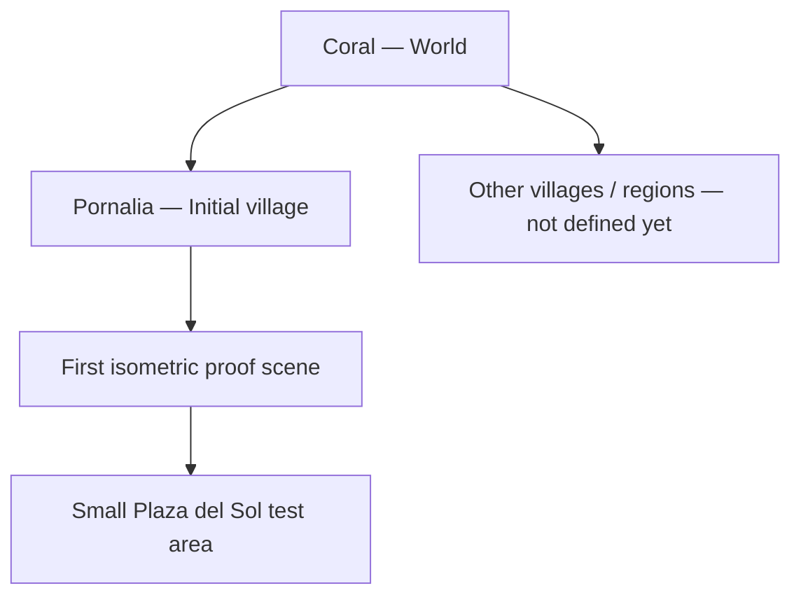
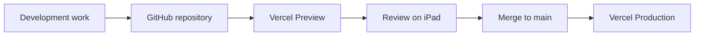

# The Legend of Comira

> **Phase 0 has begun.** The world hierarchy and architecture below remain the
> plan of record. The first isometric proof scene now exists as running code —
> see [Running the proof scene](#running-the-proof-scene). Everything beyond
> that scene is still planning only.

## Running the proof scene

```bash
npm install
npm run dev
```

The Pornalia proof scene renders a small slice of Plaza del Sol on a 2:1
isometric grid and lets you walk **Comira** around it. Drag anywhere to steer
with the floating joystick, or tap a tile to walk there — both schemes are live
so they can be compared, as the control plan requires. Arrow keys and WASD work
on desktop as a convenience; nothing depends on them.

Caveats worth knowing before reading too much into it:

- The scene uses **Comira**, because hers are the only derived sprites that
  exist. Canon still has **Cova** as the playable hero.
- Ground and props are **procedural placeholder shapes generated at runtime**,
  not art assets. Pornalia has no runtime art yet, and the asset docs forbid
  manufacturing placeholder art files just to fill the tree.
- Movement is restricted to the four isometric diagonals, which are the axes
  Comira has authored walk cycles for. There is no south-facing walk in the
  surviving reference crops.
- No Tiled map, elevation, or sign interaction yet — those are still ahead.

## 1. Project vision

**The Legend of Comira** will be a **touch-first isometric exploration RPG** set in the fantasy world of **Coral**.

### World hierarchy

**Coral is the world.** Coral contains multiple towns/villages and regions. **Pornalia is one village inside Coral**, not the name of the whole world.

Pornalia is the **initial village**, and it is the location we will use for the first isometric proof/test scene. During the current planning phase, Pornalia is our main environment focus; other Coral villages should not be invented or implemented until they are intentionally designed.



The intended experience uses a readable **2D / 2.5D isometric presentation**, with the player exploring paths, buildings, gardens and landmarks from a fixed isometric viewpoint.

- **Cova** is the playable dark/black cat hero.
- Cova does not speak.
- **Comira** is a separate white-cat heroine who appears in story/memory sequences.
- **Coral** is the larger world.
- **Pornalia** is Coral's initial village and the current test-scene focus.
- Exploration is the primary activity.
- RPG systems should support exploration rather than turn the project into a combat-heavy game.
- The old Vercel build is an early prototype only and is not the visual or technical foundation for this rebuild.

## 2. Current planning scope

We are still in **documentation and asset-structuring mode**. No gameplay implementation should begin yet.

Current scope:

1. Define Coral as the world container.
2. Organize Pornalia as a village within Coral.
3. Preserve and decompose the approved Pornalia reference map.
4. Prepare a Phaser-friendly asset hierarchy.
5. Define a very small Pornalia proof scene for a later coding phase.

Out of scope right now: building Phaser scenes, movement, collisions, quests, Supabase gameplay systems, or additional Coral villages.

## 3. Canonical characters

### Cova
Cova is the dark/black cat playable hero. All files, folders, IDs and documentation must use the spelling **Cova**.

Documentation: `docs/assets/characters/cova/README.md`

### Comira
Comira is the approved **white cat heroine**. She is a separate character, not a Cova skin or recolor.

Documentation: `docs/assets/characters/comira/README.md`

## 4. Target technology stack

| Layer | Technology | Decision / purpose |
|---|---|---|
| Language | **TypeScript** | Future game-state, scenes, entities and input |
| Game framework | **Phaser 3** | Primary future engine |
| Map editor | **Tiled** | Candidate editor for isometric maps and metadata |
| Map format | **Tiled JSON** | Planned Phaser-compatible map representation |
| Rendering | **Phaser WebGL / Canvas** | Runtime rendering path |
| Bundler | **Vite** | Development and production builds |
| Browser shell | **HTML + CSS** | Wrapper around the future game canvas |
| Package manager | **npm** | Dependencies and builds |
| Hosting | **Vercel** | Preview and production deployments |
| Version control | **GitHub** | Permanent source of truth |
| Optional backend | **Supabase** | Saves/accounts/storage only if later justified |

Three.js is not required for the planned isometric RPG. The first playable foundation should use Phaser 3 alone unless a future requirement proves real 3D is necessary.

## 5. Asset hierarchy

The asset tree must reflect the difference between a **world** and a **village**.

```text
public/assets/
├── characters/
│   ├── cova/
│   └── comira/
├── worlds/
│   └── coral/
│       ├── shared/                 # future assets shared across Coral
│       └── villages/
│           └── pornalia/           # initial village / proof-scene location
│               ├── reference/
│               ├── sections/
│               ├── tilesets/
│               ├── buildings/
│               ├── landmarks/
│               ├── props/
│               ├── interiors/
│               └── tiled/
├── ui/
├── audio/
└── fonts/
```

Existing Pornalia planning assets are currently documented in `docs/assets/map/pornalia/`. They may be migrated into the final runtime hierarchy when production assets are created; do not duplicate or manufacture placeholder runtime art merely to make the directory tree exist.

Pornalia documentation: `docs/assets/map/pornalia/README.md`

Pornalia source-image transcript: `docs/assets/map/pornalia/TRANSCRIPT.md`

## 6. Isometric rendering plan

Target projection: classic **2:1 isometric / diamond tilemap** unless the later proof scene demonstrates a better ratio.

Planned logical layers include ground, water, paths, cliffs, stairs, bridges, background buildings/vegetation, collision, navigation, interactions, characters, foreground/roof occlusion, effects and debug labels.

Correct depth sorting is a future Phase 0 requirement: Cova must appear behind or in front of Pornalia objects naturally.

## 7. Camera and touch controls

The future camera should use a fixed isometric viewing angle and smoothly follow Cova. The game must never depend on WASD because touch/iPad is a primary target.

The future proof scene should compare a virtual joystick/directional control with tap-to-move before choosing the final exploration control scheme.

## 8. First proof scene: Pornalia

The first technical scene will take place in **Pornalia**, but it must represent only a tiny slice of the village. It is not the entire village and definitely not the entire world of Coral.

Planned ingredients:

- part of Plaza del Sol;
- one short path;
- one small building facade;
- one tree;
- one bridge or elevation feature;
- one interactable sign;
- Cova.

Future acceptance criteria include touch movement, isometric-axis movement, camera following, collision, depth sorting, foreground occlusion, one interaction, and acceptable iPad performance.

Only after this proof succeeds should we begin reconstructing the full Pornalia village. Only after Pornalia's foundation is understood should additional Coral settlements be planned technically.

## 9. RPG scope

Eventually required: exploration, NPC interaction, dialogue/non-verbal Cova reactions, objectives, discoverable locations, interactable objects, story/key-item inventory, interiors/area transitions, save state and Comira memory triggers.

Not required for the first proof: combat, levels, skill trees, crafting, multiplayer, procedural infinite worlds or realtime backend.

## 10. Deployment architecture

The desired workflow remains GitHub-first:



Known Vercel project metadata:

- Project: `the-legend-of-comira`
- Project ID: `prj_Yvz8FfMCrwZAT0fqJWEo8J2RnG8y`
- Framework metadata: **Vite**
- Node metadata: **24.x**
- Production domain: `the-legend-of-comira.vercel.app`

Historical production deployments were created from ChatGPT-local project files. The target workflow is for GitHub to become the permanent source of truth and Vercel to deploy from GitHub.

## 11. Supabase

Supabase remains optional. The isometric proof scene requires **no backend**. Potential later uses include cloud saves, accounts, inventory persistence, collectibles and achievements. Privileged service credentials must never ship in the browser bundle.

## 12. Development phases

### Current — planning and asset structure
- Define Coral/Pornalia hierarchy.
- Organize Cova and Comira references.
- Preserve/decompose Pornalia reference art.
- Document Phaser/Tiled reconstruction strategy.
- No gameplay code.

### Future Phase 0 — Pornalia proof scene
After explicit approval to code, build the tiny isometric test area inside Pornalia.

### Future Phase 1 — Cova vertical slice
Directional representation, touch movement, collisions, depth sorting, interaction and camera follow.

### Future Phase 2 — Pornalia blockout
Reconstruct the actual initial village from reusable map assets.

### Future Phase 3+ — Coral expansion
Only after Pornalia is established, define and add other Coral villages/regions as separate world locations.

## 13. Canonical rule going forward

When documentation says **Coral**, it means the overall game world.

When documentation says **Pornalia**, it means the initial village inside Coral.

When documentation says **Pornalia proof/test scene**, it means the small technical scene derived from Pornalia that will eventually validate the isometric Phaser foundation.

Do not use Pornalia and Coral interchangeably.
