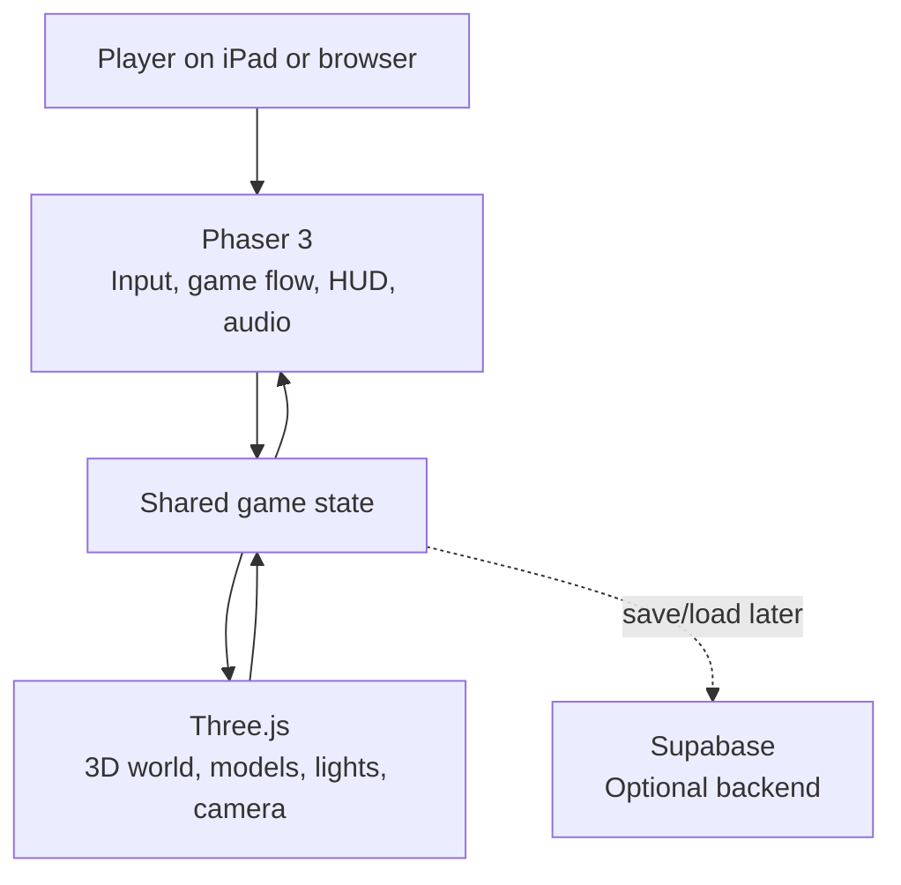
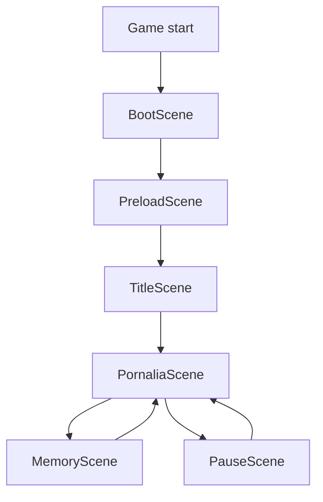
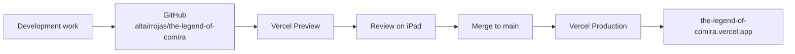
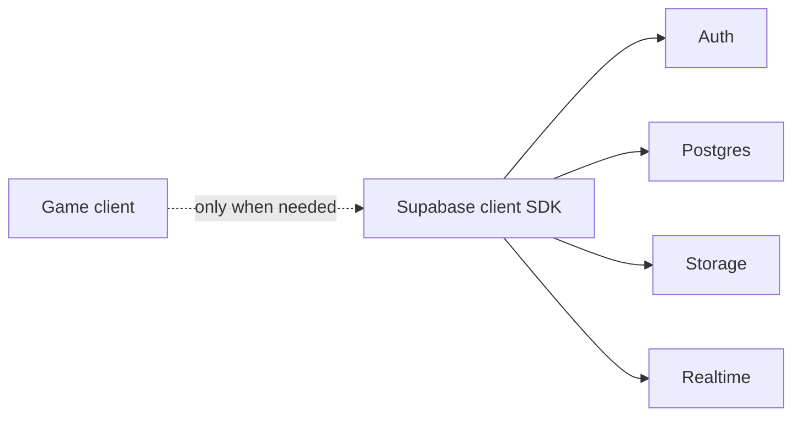
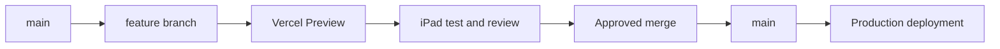

# The Legend of Comira

> Planning document only. This revision does **not** add or change game code.

## 1. Project goal

**The Legend of Comira** is a touch-first browser adventure set in **Pornalia**.

- **Cova** is the playable character.
- Cova does not speak.
- **Comira** is a separate white-cat heroine who appears in story/memory sequences.
- Pornalia is an original fantasy village/world.
- The old Vercel build is only an early prototype and is not the visual or technical foundation for the rebuild.

## 2. Canonical character naming

### Cova

Cova is the dark/black cat character used as the playable hero. All files, folders, IDs and documentation must use the spelling **Cova**.

### Comira

Comira is the approved **white cat heroine**. She is not a skin or recolor of Cova.

Her detailed asset specification lives at:

`docs/assets/characters/comira/README.md`

Cova's separate character documentation lives at:

`docs/assets/characters/cova/README.md`

## 3. Target technology stack

| Layer | Technology | Purpose |
|---|---|---|
| Language | **TypeScript** | Safer game-state, scene, input and asset code |
| Game framework | **Phaser 3** | Game lifecycle, input, HUD, audio, loading and orchestration |
| 3D renderer | **Three.js** | 3D world, models, lighting and camera |
| Bundler / dev server | **Vite** | Development and production build pipeline |
| Browser shell | **HTML + CSS** | Minimal wrapper around the game canvas/layers |
| Package manager | **npm** | Dependency and build management |
| Hosting | **Vercel** | Preview and production deployments |
| Version control | **GitHub** | Permanent source of truth |
| Optional backend | **Supabase** | Saves, accounts, storage or realtime only when needed |

### Why Phaser + Three.js

Phaser is the main game framework because it already provides scene management, loading, input, tweens, audio and browser/mobile game utilities. Three.js supplies the real 3D rendering layer for Pornalia, characters, lighting and camera.

## 4. Runtime architecture



### Rendering plan

- Three.js owns the main 3D world.
- Phaser manages the game lifecycle and may render transparent 2D overlays for touch controls, HUD, prompts, fades and dialogue.
- Both layers use one authoritative shared state so the character model cannot visually detach from movement/state.

## 5. Internal game flow



Scene responsibilities:

- **BootScene** — device/render capability checks and basic configuration.
- **PreloadScene** — character, world, UI and audio assets.
- **TitleScene** — start/continue flow.
- **PornaliaScene** — main playable world.
- **MemoryScene** — Comira story/memory sequences.
- **PauseScene** — resume, settings and touch-control options.

## 6. Planned repository structure

```text
the-legend-of-comira/
├── README.md
├── docs/
│   └── assets/
│       ├── characters/
│       │   ├── comira/
│       │   │   └── README.md
│       │   └── cova/
│       │       └── README.md
│       ├── comira-blanca-reference.svg
│       └── cova-oscuro-atigrado-reference.svg
├── public/
│   └── assets/
│       ├── characters/
│       │   ├── cova/
│       │   └── comira/
│       ├── worlds/
│       │   └── pornalia/
│       ├── ui/
│       ├── audio/
│       └── fonts/
├── src/
│   ├── main.ts
│   ├── game/
│   │   ├── config/
│   │   ├── scenes/
│   │   ├── entities/
│   │   ├── systems/
│   │   │   ├── input/
│   │   │   ├── movement/
│   │   │   ├── camera/
│   │   │   ├── interaction/
│   │   │   └── save/
│   │   └── state/
│   ├── three/
│   │   ├── world/
│   │   ├── camera/
│   │   ├── loaders/
│   │   └── animation/
│   ├── ui/
│   ├── services/
│   │   └── supabase/
│   └── styles/
└── tests/
    ├── unit/
    └── e2e/
```

## 7. Comira asset definition

Comira's approved sheet defines:

- white/warm-ivory fur;
- pale peach inner ears;
- large glossy dark eyes;
- small nose and rounded friendly face;
- subtle cheek blush;
- compact chibi proportions with visible paws/legs;
- fluffy white tail;
- muted sage-green scarf/cape;
- brown diagonal harness;
- small brown satchel;
- cyan/light-blue crystal pendant;
- Light Staff with brown shaft, blue crystal head and gold accents;
- light/solar visual language.

Minimum expressions:

- happy;
- surprised;
- thoughtful;
- sad;
- angry.

Minimum action/animation targets:

- idle;
- blink;
- walk;
- run;
- turn;
- jump;
- attack with staff;
- heal/cast light magic;
- interact;
- read/explore map;
- hurt/recover.

Target runtime asset tree:

```text
public/assets/characters/comira/
├── model/
├── animations/
├── sprites/
├── portraits/
├── expressions/
├── props/
├── vfx/
└── ui/
```

Reference art stays under `docs/assets`; it should not silently become a runtime texture.

## 8. Deployment architecture

Historical production deployments were created from ChatGPT-local project files. The desired workflow is now GitHub-first:



Known Vercel project metadata:

- Project: `the-legend-of-comira`
- Project ID: `prj_Yvz8FfMCrwZAT0fqJWEo8J2RnG8y`
- Framework metadata: **Vite**
- Node metadata: **24.x**
- Production domain: `https://the-legend-of-comira.vercel.app`

### GitHub → Vercel verification gate

Before coding resumes:

1. Confirm Vercel Git settings point to `altairrojas/the-legend-of-comira`.
2. Confirm production branch is `main`.
3. Make a harmless docs-only commit.
4. Confirm Vercel creates a Git-sourced preview or production deployment.
5. Confirm GitHub receives the Vercel deployment/check result.
6. Confirm the existing `.vercel.app` production domain remains attached to the same Vercel project.

Until those checks pass, the automatic GitHub → Vercel link is considered **configured but not end-to-end verified**.

## 9. Optional Supabase architecture



Potential future uses include cloud saves, accounts, inventory, collectibles, achievements, server-managed content and realtime features. Privileged service credentials must never be shipped in the browser bundle.

## 10. Development phases

### Phase 0 — Phaser + Three proof

Prove:

- touch input on iPad;
- one moving 3D character;
- camera follow/orbit;
- Phaser HUD overlay;
- stable resize/orientation handling;
- acceptable performance.

### Phase 1 — Cova vertical slice

- Approved Cova model.
- Visible paws/legs.
- Tail/cape/equipment.
- Idle, walk, turn and stop animations.
- Touch controls.
- Camera follow and swipe orbit.

### Phase 2 — Pornalia blockout

- Terrain and paths.
- Major landmarks.
- Collision boundaries.
- Camera constraints.
- Basic interactions.

### Phase 3 — Pornalia visual pass

- Houses.
- School of the Wind.
- School of the Light.
- Plaza.
- Nature, props, lighting and atmosphere.

### Phase 4 — Comira story integration

Build Comira from her canonical white-cat specification and then add her story/memory sequences, Light Staff interactions and VFX.

### Phase 5 — Persistence decision

Choose local browser saves or Supabase only after gameplay requirements are known.

## 11. Git workflow



Rules:

- `main` stays deployable.
- Large changes use feature branches.
- Gameplay milestones are tested on iPad through Vercel Preview before merge.
- Secrets are never committed.
- Asset names and character ownership must stay explicit.

## 12. State trace

1. An early playable prototype was created in ChatGPT's local workspace.
2. It was deployed directly to Vercel; GitHub was not the original deployment source.
3. Touch controls were added for iPad play.
4. The placeholder character/world quality was considered insufficient.
5. GitHub repository `altairrojas/the-legend-of-comira` became the intended source of truth.
6. The target architecture is TypeScript + Phaser 3 + Three.js + Vite.
7. Comira is canonically the white-cat heroine.
8. Cova is the correctly spelled dark/black cat playable character.
9. Comira and Cova have separate documentation and asset trees.
10. No gameplay code was changed in this planning/documentation pass.

## 13. Gate before coding resumes

- [ ] Review and approve Phaser + Three architecture.
- [ ] Review and approve Comira asset specification.
- [ ] Keep Cova and Comira fully separate.
- [ ] Verify GitHub → Vercel deployment end-to-end.
- [ ] Create Phase 0 proof on a feature branch.
- [ ] Test Phase 0 on iPad before building Pornalia.
