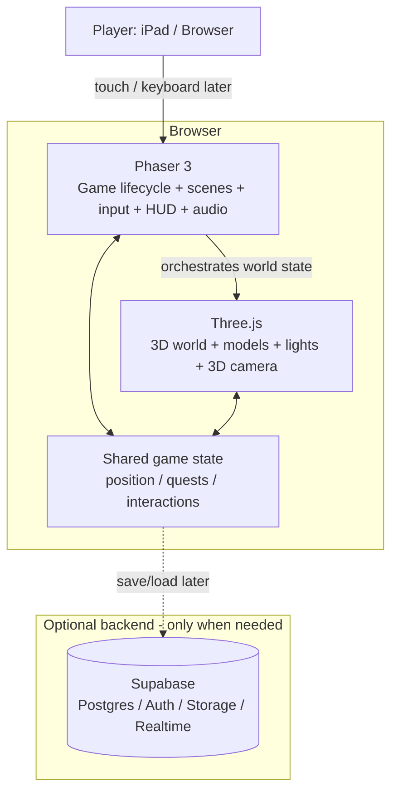
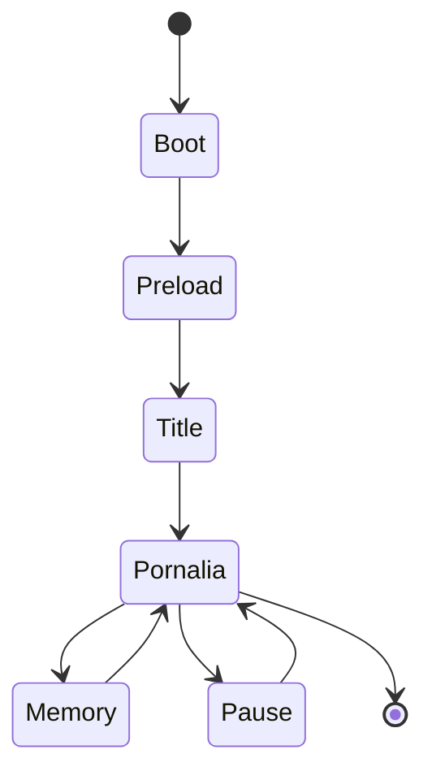
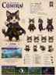
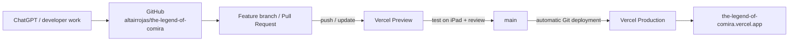
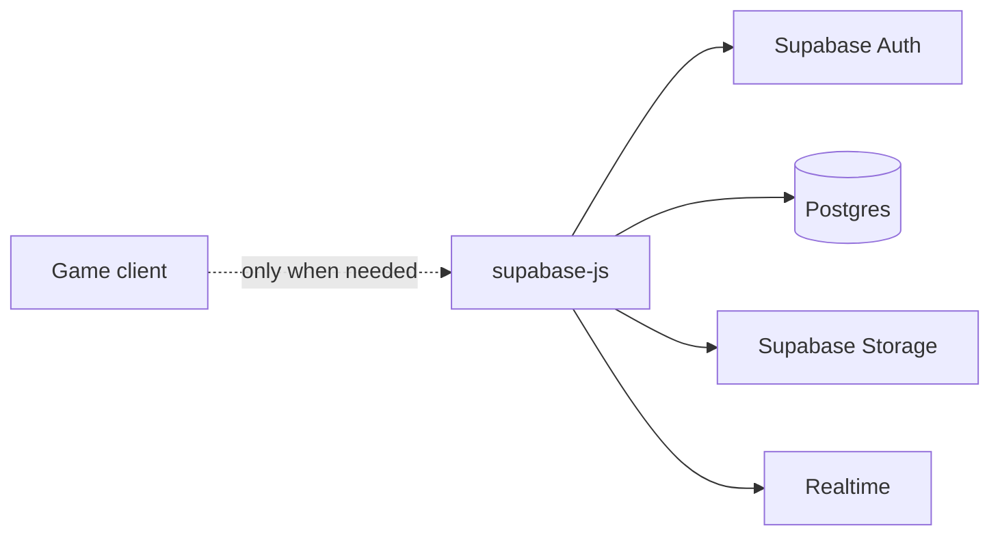
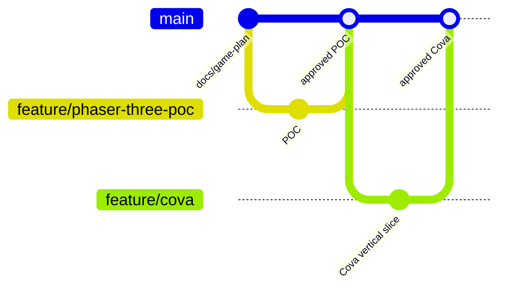

# The Legend of Comira

> **Planning pass only.** This revision does **not** add or change game code. It defines the target architecture, project routes, deployment workflow, integrations, current status, and recovery plan before implementation resumes.

## 1. Project goal

**The Legend of Comira** is a browser game centered on **Cova** and the world of **Pornalia**. The current production site is an early prototype and is **not** considered the technical foundation for the next version.

The next version should be designed first for **touch devices / iPad**, while still supporting desktop controls later.

Key story / game constraints already established:

- Cova is the playable character.
- Cova does not speak.
- Comira is lost during the story and later appears through memories.
- Pornalia is an original fantasy village / world.
- Cova must use the final dark gray / white tabby design, not the old brown placeholder.
- Character legs / paws must be visible and animated.
- The world should feel explorable, not like a static slideshow.

---

## 2. Current status

### GitHub

- Repository: `altairrojas/the-legend-of-comira`
- Default branch: `main`
- GitHub is now writable from ChatGPT through the installed ChatGPT GitHub App.
- GitHub is the intended **source of truth** from this point forward.

### Vercel

- Project: `the-legend-of-comira`
- Project ID: `prj_Yvz8FfMCrwZAT0fqJWEo8J2RnG8y`
- Existing framework metadata: **Vite**
- Existing Node runtime metadata: **24.x**
- Production domain: `https://the-legend-of-comira.vercel.app`
- Existing production deployments: two historical deployments, both `READY`.
- These historical deployments were created from ChatGPT-local project files, **not from GitHub**.

### GitHub → Vercel connection verification

The GitHub App is reported as installed for Vercel, but the automatic Git-to-Vercel project link is **not yet proven end-to-end**.

Evidence checked during this planning pass:

1. A new README commit was successfully created in GitHub.
2. GitHub shows no Vercel status/check on that commit.
3. Vercel shows no new deployment after that README commit.
4. The two existing Vercel deployments have empty Git metadata because they came from the earlier local-file deployment path.

**Conclusion:** GitHub access works, and the Vercel project works, but before game coding resumes we must complete one explicit integration test: make a harmless documentation-only commit and confirm that Vercel creates a Preview or Production deployment from GitHub. Until that happens, the README should describe the connection as **installed/configured but not yet end-to-end verified**.

### Supabase

Supabase is available to this project if persistence is needed later.

- ChatGPT can access the connected Supabase account.
- One Supabase project is currently visible: `altairrojas's Project`.
- Current Supabase project status observed: `INACTIVE`.
- Database engine: PostgreSQL 17.
- Region: `ca-central-1`.
- The game does **not** currently depend on Supabase.
- The owner reports that the Supabase GitHub App is also installed. The current GitHub connector does not expose installed-app inventory, so that specific GitHub-side installation cannot be independently verified here.

Supabase should remain **optional** until we actually need saves, accounts, cloud inventory, achievements, multiplayer state, analytics, or content managed outside the build.

---

## 3. Target technology stack

### Core stack

| Layer | Technology | Decision |
|---|---|---|
| Language | **TypeScript** | Preferred for safer game-state, asset, scene, and input code |
| Game framework | **Phaser 3** | Main game framework: scene lifecycle, loaders, input, tweens, audio, 2D UI, collision helpers |
| 3D renderer | **Three.js** | Required for real 3D world rendering because Phaser itself is a 2D framework |
| Bundler / dev server | **Vite** | Already compatible with the existing Vercel project and ideal for Phaser / Three ES modules |
| Browser shell | HTML + CSS | Minimal wrapper around the game canvases; no UI framework by default |
| Package manager | npm | Simplest path with Vercel / Vite |
| Hosting | **Vercel** | Preview + Production deployments |
| Version control | **GitHub** | Permanent source of truth |
| Optional backend | **Supabase** | Postgres, Auth, Storage, Realtime only when a game feature requires them |

### Why Phaser + Three.js

Phaser is intentionally kept as the **game framework** because it already provides mature systems for scenes, loading, input, animation/tweens, audio, game loops, cameras for 2D layers, and browser/mobile support.

However, Phaser's official documentation states that Phaser is a **2D game framework** and does not provide built-in 3D rendering or 3D physics. Therefore the target architecture uses:

- **Phaser** for game flow, input, HUD, menus, state, 2D effects, audio, and orchestration.
- **Three.js** for the actual 3D world, models, lighting, 3D camera, and scene graph.

This avoids pretending Phaser alone is a 3D engine while still getting the benefits requested from Phaser.

### Deliberate non-decisions

These are **not** selected yet:

- No React unless the project later needs complex non-game UI.
- No multiplayer architecture yet.
- No physics engine beyond Phaser helpers / basic Three collision planning until movement requirements are tested.
- No Supabase dependency in the first playable rebuild.
- No third-party open-world starter repository has been adopted yet. Reusable GitHub utilities should be evaluated after the minimal architecture works.

---

## 4. Runtime architecture



### Canvas strategy

Planned rendering model:

- Three.js owns the main 3D world canvas.
- Phaser owns game lifecycle and may render a transparent 2D overlay canvas for HUD, prompts, dialogue cards, touch controls, fades, and visual effects.
- Both layers share a single authoritative game-state module so Cova cannot visually separate from the movement state.

A very small proof-of-concept must validate this integration **before** building Pornalia.

---

## 5. Game route / scene map

For the first rebuild, browser routing should stay intentionally simple. This is a game, not a multi-page website.

### Web routes

| Route | Purpose | Phase |
|---|---|---|
| `/` | Loads the application and starts the Phaser bootstrap | Required |
| `/*` | Optional SPA fallback to `/index.html` if deep links are introduced later | Later |

No public API route is required for the first playable version.

### Internal game scenes



Planned responsibilities:

- **BootScene** — device capabilities, renderer checks, basic configuration.
- **PreloadScene** — load Cova, environment, textures, UI, audio.
- **TitleScene** — title screen / start / continue later.
- **PornaliaScene** — main playable world.
- **MemoryScene** — Comira memory sequences.
- **PauseScene** — settings / resume / accessibility / touch controls.

Additional worlds should become separate scenes or world modules only after Pornalia is stable.

---

## 6. Planned repository routes

> These paths are the **target structure**. Most do not exist yet. Do not interpret this section as implemented code.

```text
the-legend-of-comira/
├── README.md
├── docs/
│   ├── assets/
│   │   ├── comira-blanca-reference.svg
│   │   └── cova-oscuro-atigrado-reference.svg
│   ├── architecture/
│   └── decisions/
├── public/
│   └── assets/
│       ├── characters/
│       │   ├── cova/
│       │   └── comira/
│       ├── worlds/
│       │   └── pornalia/
│       ├── ui/
│       ├── audio/
│       └── fonts/
├── src/
│   ├── main.ts
│   ├── game/
│   │   ├── config/
│   │   ├── scenes/
│   │   ├── entities/
│   │   ├── systems/
│   │   │   ├── input/
│   │   │   ├── movement/
│   │   │   ├── camera/
│   │   │   ├── interaction/
│   │   │   └── save/
│   │   └── state/
│   ├── three/
│   │   ├── world/
│   │   ├── camera/
│   │   ├── loaders/
│   │   └── animation/
│   ├── ui/
│   ├── services/
│   │   └── supabase/
│   └── styles/
└── tests/
    ├── unit/
    └── e2e/
```

### Asset conventions

- 3D characters / world props: prefer **glTF / GLB**.
- 2D textures / UI: PNG or WebP.
- Audio: browser-friendly formats with at least one broadly supported fallback.
- Reference art belongs in `docs/assets`, not in the runtime build unless the game actually uses it.

---

## 7. Visual references currently preserved in GitHub

### Comira — white reference


### Dark / tabby character reference currently available (Cova)



> Note: the current recovered asset set contains a clear **white Comira** reference and a clear **dark/tabby Cova** reference. A separate dedicated **black Comira** sheet was not found in the recovered local files, so this README does not pretend one exists. If the intended second image is a different Comira reference, it should be added when identified.

---

## 8. Deployment architecture

### Desired final flow



### Intended Vercel configuration

- Existing Vercel project should be reused: **do not create a second production project unless migration requires it**.
- Framework preset: Vite.
- Production branch: `main`.
- Build command: use the project's package script for Vite build once code exists.
- Output directory: Vite default `dist` unless deliberately changed.
- Preview deployments: every feature branch / PR.
- Production deployment: `main` only.
- Public production domain remains `the-legend-of-comira.vercel.app`.

### GitHub / Vercel verification gate

Before coding the rebuild:

1. Confirm the Vercel Git settings point specifically to `altairrojas/the-legend-of-comira`.
2. Confirm production branch is `main`.
3. Make a docs-only commit.
4. Confirm Vercel creates a Git-sourced deployment.
5. Confirm GitHub receives a Vercel deployment/check result.
6. Confirm the existing custom `.vercel.app` domain remains on the same Vercel project.

Only after all six checks pass should GitHub → Vercel be considered fully verified.

---

## 9. Optional Supabase architecture



Potential future uses:

- Save slots / checkpoints.
- Player account / cloud saves.
- Inventory / collectibles.
- Achievements.
- Downloadable or server-managed game content.
- Realtime multiplayer features, if ever approved.

Security rule for future implementation: browser code may use a **publishable** Supabase key, but privileged server/service credentials must never be shipped in the client bundle.

---

## 10. Development phases

### Phase 0 — Architecture proof

No Pornalia build yet.

Goal: prove that Phaser + Three.js can cooperate cleanly on iPad.

Acceptance criteria:

- Touch input works.
- One simple 3D character can move.
- Camera can orbit / follow without detaching the model.
- Phaser HUD overlays correctly.
- Stable frame rate on the target iPad.
- Resize / orientation change does not break the game.

### Phase 1 — Cova vertical slice

- Replace placeholder with the approved Cova model.
- Proper body, four paws / legs, tail, cape, face, and equipment.
- Idle, walk, turn, and stop animations.
- Touch joystick / directional controls.
- Camera follow + swipe orbit.

### Phase 2 — Pornalia blockout

- Terrain and paths.
- Major landmarks only.
- Collision boundaries.
- Camera constraints.
- Basic interactable doors / signs.

### Phase 3 — Pornalia visual pass

- Houses.
- School of the Wind.
- School of the Light.
- Plaza.
- Nature, props, lighting, atmosphere.
- Mui / Corìo references later, after core play is stable.

### Phase 4 — Story / memories

- Comira memory scenes.
- Trigger system.
- Non-verbal Cova reactions.
- Save / checkpoint requirements evaluated here.

### Phase 5 — Persistence decision

At this point decide whether local browser saves are enough or Supabase is justified.

---

## 11. Git workflow



Rules:

- `main` should stay deployable.
- Large changes use feature branches.
- Every gameplay milestone is tested through Vercel Preview on iPad before merge.
- Do not commit secrets.
- Assets should have clear names and ownership / origin recorded.

---

## 12. State trace

### Historical prototype

1. A first web prototype was created in ChatGPT's local workspace.
2. It was deployed directly to Vercel from those local files.
3. GitHub was **not** the source of that deployment.
4. The prototype used a very simple placeholder Cova and simple Pornalia geometry.
5. Touch controls were added because the target player was on iPad.
6. The prototype proved that a browser-hosted playable page was possible, but the art / character / world quality was insufficient.

### Repository recovery

1. GitHub repository `altairrojas/the-legend-of-comira` was created.
2. Initial ChatGPT GitHub writes failed because the ChatGPT GitHub App was not installed.
3. After installation, ChatGPT gained repository write access.
4. README was successfully committed.
5. Reference assets were added under `docs/assets`.
6. The project is now intentionally paused before code reconstruction so the architecture can be agreed first.

---

## 13. Definition of done before coding resumes

The planning stage is complete only when these are reviewed and accepted:

- [ ] Phaser 3 confirmed as primary game framework.
- [ ] Three.js accepted as the 3D renderer companion.
- [ ] TypeScript + Vite accepted.
- [ ] Repository route layout accepted.
- [ ] Scene / game route map accepted.
- [ ] GitHub → Vercel automatic deployment verified end-to-end.
- [ ] iPad-first control requirement accepted.
- [ ] Supabase remains optional until a concrete need appears.
- [ ] Correct visual references for Cova and Comira are identified.

No game implementation should begin before this checklist is reviewed.

---

## 14. Reference documentation

Primary technical references used for this plan:

- Phaser documentation: https://docs.phaser.io/
- Phaser getting started: https://phaser.io/tutorials/getting-started-phaser3
- Three.js manual: https://threejs.org/manual/en/creating-a-scene.html
- Vercel Git deployments: https://vercel.com/docs/git
- Vercel GitHub integration: https://vercel.com/docs/git/vercel-for-github
- Supabase JavaScript client: https://supabase.com/docs/reference/javascript/introduction
- Supabase database overview: https://supabase.com/docs/guides/database/overview
- Supabase Auth: https://supabase.com/docs/guides/auth

---

## 15. Current planning verdict

**Recommended architecture:**

> **TypeScript + Phaser 3 + Three.js + Vite → GitHub → Vercel**, with **Supabase optional**.

The next action is **not coding**. The next action is to review this README, confirm the architecture, and complete the GitHub → Vercel verification gate.
