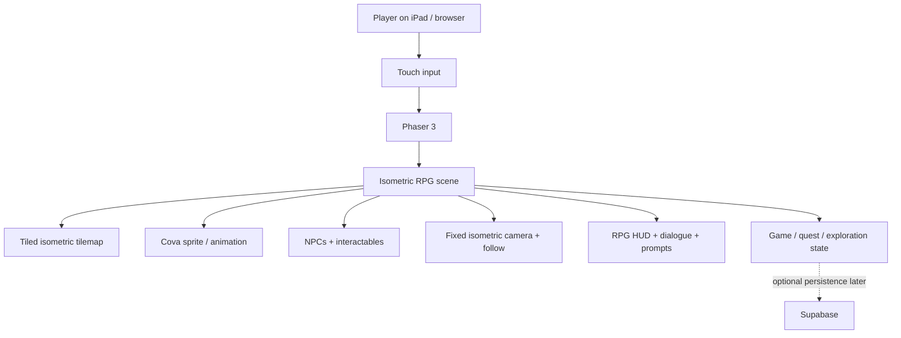
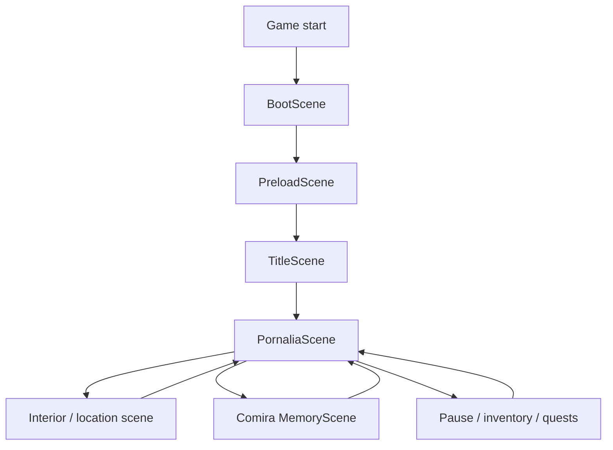
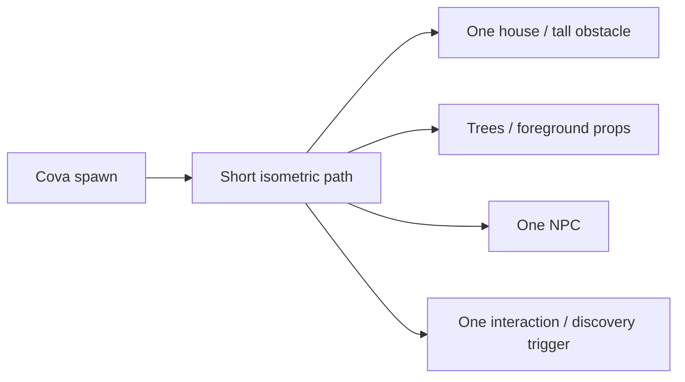
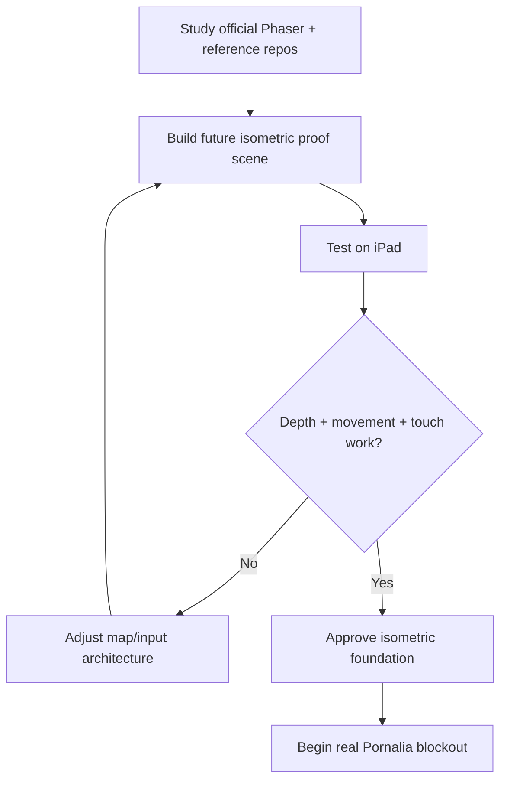
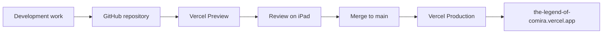

# The Legend of Comira

> **Planning document only.** This revision changes the game plan and architecture, but adds **no gameplay code**.

## 1. Project vision

**The Legend of Comira** will be a **touch-first isometric exploration RPG** set primarily in **Pornalia**.

The intended experience is no longer a free-camera 3D/open-world prototype. The game should use a readable **2D / 2.5D isometric presentation**, with the player exploring paths, buildings, gardens and landmarks from a fixed isometric viewpoint.

- **Cova** is the playable dark/black cat hero.
- Cova does not speak.
- **Comira** is a separate white-cat heroine who appears in story/memory sequences.
- Pornalia is an original fantasy village/world.
- Exploration is the primary activity.
- RPG systems should support exploration rather than turn the project into a combat-heavy game.
- The old Vercel build is an early prototype only and is not the visual or technical foundation for this rebuild.

### Core design pillars

1. **Explore:** walk through Pornalia and discover places, paths and secrets.
2. **Discover:** environmental storytelling, objects, NPCs and Comira memories reward curiosity.
3. **Interact:** inspect objects, enter important places, trigger events and solve lightweight environmental challenges.
4. **Progress:** quests, discoveries and story milestones gradually unlock new areas or abilities.
5. **Touch first:** the complete game must be comfortable on iPad without WASD or a physical keyboard.
6. **Readable isometric world:** character depth, occlusion and walkable areas must always be understandable.

## 2. Canonical characters

### Cova

Cova is the dark/black cat playable hero. All files, folders, IDs and documentation must use the spelling **Cova**.

Cova documentation: `docs/assets/characters/cova/README.md`

### Comira

Comira is the approved **white cat heroine**. She is a separate character, not a Cova skin or recolor.

Comira documentation: `docs/assets/characters/comira/README.md`

## 3. Target technology stack

| Layer | Technology | Decision / purpose |
|---|---|---|
| Language | **TypeScript** | Game-state, scenes, entities, input and asset code |
| Game framework | **Phaser 3** | Primary engine: scenes, input, cameras, animation, audio, tilemaps, collisions and UI |
| Map editor | **Tiled** | Candidate editor for isometric maps and object/layer metadata |
| Map format | **Tiled JSON** | Phaser can load Tiled isometric tilemaps directly |
| Rendering | **Phaser WebGL / Canvas** | Primary runtime rendering path |
| Bundler | **Vite** | Development and production build pipeline |
| Browser shell | **HTML + CSS** | Minimal wrapper around the game canvas |
| Package manager | **npm** | Dependencies and builds |
| Hosting | **Vercel** | Preview and production deployments |
| Version control | **GitHub** | Permanent source of truth |
| Optional backend | **Supabase** | Saves/accounts/storage only if later justified |

### Architecture change: Three.js is no longer required

The previous plan paired Phaser with Three.js for a fully 3D world. The new isometric RPG direction makes that complexity unnecessary for the first implementation.

**Default decision:** build the first playable scene entirely in Phaser 3.

Phaser has supported isometric Tiled tilemaps since Phaser 3.50. That gives us a substantially simpler architecture and is much closer to the desired RPG style.

Three.js is therefore moved from **required stack** to **rejected/deferred experiment**. It should only return if a future feature genuinely requires real 3D geometry that cannot reasonably be represented with isometric art.

## 4. Isometric rendering model



### Visual model

Target projection: classic **2:1 isometric / diamond tilemap** unless the proof scene demonstrates a better ratio.

The world should be constructed from layers such as:

1. ground;
2. paths/water;
3. low decoration;
4. buildings/large props;
5. characters/NPCs;
6. foreground/roof/occlusion layers;
7. effects;
8. HUD.

Correct depth sorting is a **Phase 0 requirement**. Cova must appear behind or in front of objects naturally as she moves through the map.

## 5. Camera and controls

The camera is no longer a freely orbiting 3D camera.

### Camera

- fixed isometric viewing angle;
- follows Cova smoothly;
- does not rotate during ordinary exploration;
- map bounds prevent showing empty world outside Pornalia;
- optional small look-ahead in the movement direction;
- zoom may be evaluated, but is not required for the proof scene.

### iPad controls

The design must never depend on WASD.

Primary candidates to test:

- virtual joystick / directional pad for continuous exploration;
- tap-to-move as an alternative or accessibility option;
- large context-sensitive interaction button;
- touch-friendly pause/inventory/quest controls.

The proof scene should compare joystick movement with tap-to-move before selecting the final exploration control scheme.

## 6. RPG scope

This is an **exploration RPG**, so the first systems should be deliberately small.

### Required eventually

- exploration and movement;
- NPC interaction;
- dialogue / non-verbal Cova reactions;
- quests or objectives;
- discoverable locations;
- interactable objects;
- inventory for story/key items;
- area transitions / interiors;
- checkpoints/save state;
- Comira memory/story triggers.

### Not required for the first proof

- combat;
- character levels;
- skill trees;
- crafting;
- multiplayer;
- procedural infinite worlds;
- realtime backend.

These features require a separate design decision before implementation.

## 7. Internal game flow



## 8. Planned repository structure

```text
the-legend-of-comira/
├── README.md
├── docs/
│   ├── research/
│   │   └── isometric-reference-projects.md   # planned
│   └── assets/
│       ├── characters/
│       │   ├── comira/
│       │   │   └── README.md
│       │   └── cova/
│       │       └── README.md
│       ├── comira-blanca-reference.svg
│       └── cova-oscuro-atigrado-reference.svg
├── public/
│   └── assets/
│       ├── characters/
│       │   ├── cova/
│       │   └── comira/
│       ├── worlds/
│       │   └── pornalia/
│       │       ├── maps/
│       │       ├── tilesets/
│       │       ├── props/
│       │       └── interiors/
│       ├── ui/
│       ├── audio/
│       └── fonts/
├── src/
│   ├── main.ts
│   ├── game/
│   │   ├── config/
│   │   ├── scenes/
│   │   ├── entities/
│   │   ├── systems/
│   │   │   ├── input/
│   │   │   ├── movement/
│   │   │   ├── pathfinding/
│   │   │   ├── depth-sorting/
│   │   │   ├── interaction/
│   │   │   ├── dialogue/
│   │   │   ├── quests/
│   │   │   ├── inventory/
│   │   │   └── save/
│   │   └── state/
│   ├── ui/
│   ├── services/
│   │   └── supabase/
│   └── styles/
└── tests/
```

This is a **target structure**, not evidence that these files already exist.

## 9. Reference-project research — no code adopted yet

The following projects/resources are research candidates only. **Nothing from them has been copied into this repository.** Before adopting code or assets we must review architecture, maintenance status, license and whether the technique works well on iPad.

### Candidate A — official Phaser isometric tilemap support

Phaser itself is the strongest starting point. Since Phaser 3.50 it can import **isometric, hexagonal and staggered isometric tilemaps from Tiled**. The official Phaser examples include an `isorpg.json` isometric RPG map example.

**Why it matters:** this may let us avoid an extra isometric rendering plugin entirely.

Research:
- Phaser official isometric tilemap examples.
- Phaser official examples repository: `phaserjs/examples`.

**Priority: VERY HIGH.** Start here before third-party plugins.

### Candidate B — Nulligma/phaser-isometric-test

GitHub project: `Nulligma/phaser-isometric-test`.

It demonstrates Phaser 3 + TypeScript with:

- an elevated isometric Tiled map;
- multiple floors;
- depth sorting;
- A* pathfinding;
- walkable tiles;
- camera/tile coordinate handling across elevations.

**Why it matters:** these are almost exactly the technical questions our Pornalia proof scene must answer.

License reported by the repository: **MIT**.

**Priority: HIGH for architecture research.** Do not blindly fork it; first study how it solves depth, elevation and pathfinding.

### Candidate C — mattiaa95/realmforge

GitHub project: `mattiaa95/realmforge`.

A browser-based 2D isometric MMORPG using a **Phaser 3 + TypeScript client**. Its full MMO/server architecture is far beyond what The Legend of Comira needs, but it can be studied for isometric world organization and browser rendering patterns.

**Priority: MEDIUM for research only.** Avoid importing its multiplayer/server complexity.

### Candidate D — rexrainbow/phaser3-rex-notes / Rex plugins

Rex's Phaser plugin collection includes board/grid utilities and an isometric grid mode, plus many UI and movement utilities.

Potentially useful later for:

- touch UI;
- movement helpers;
- board/grid calculations;
- dialogue/UI components.

**Priority: MEDIUM.** Add individual plugins only when they solve a demonstrated need.

### Candidate E — mipearson/dungeondash

Open-source Phaser 3 + TypeScript dungeon-crawler experiment.

It is not our visual target, but it may provide useful examples for RPG project organization and field-of-view / dungeon systems.

**Priority: LOW/MEDIUM.** Architectural inspiration only.

### GitLab research status

Initial public searches did not produce a GitLab project as directly relevant as the Phaser/GitHub candidates above. Do not choose a weaker dependency merely to have a GitLab option. Continue searching during the proof-scene research phase.

## 10. Proposed proof scene — planning only

Before rebuilding Pornalia, create a tiny **Isometric Playground** on a future feature branch.

The scene should contain only enough content to answer technical questions:



### Proof-scene acceptance criteria

- [ ] Loads an isometric Tiled JSON map in Phaser.
- [ ] Cova moves in all useful world directions using touch.
- [ ] Movement visually matches the isometric axes.
- [ ] Camera follows Cova smoothly.
- [ ] Cova cannot walk through blocked tiles/objects.
- [ ] Depth sorting works around at least one tree and one building.
- [ ] Foreground occlusion is readable.
- [ ] One NPC or object can be interacted with.
- [ ] One simple dialogue/prompt appears.
- [ ] Test both virtual joystick and tap-to-move.
- [ ] Runs acceptably on the target iPad.
- [ ] Orientation/resize does not destroy the scene.

### What the proof scene must NOT become

Do not build the real Pornalia map during Phase 0. Do not add quests, combat, inventory, Supabase or polished art just to make the technical test look like a finished game.

## 11. Decision gate after the proof scene



Only after this gate passes should the project begin building the actual world.

## 12. Comira asset definition

Comira remains canonically a white/warm-ivory cat with pale peach inner ears, large glossy dark eyes, compact chibi proportions, fluffy tail, muted sage-green scarf/cape, brown harness and satchel, cyan crystal pendant and Light Staff.

Her target actions include idle, blink, walk, run, turn, jump, attack/cast if later required, heal/light magic, interact, explore/read map and hurt/recover.

For the isometric game, character production will eventually require an additional decision: **directional sprite sheets / rendered directions** must cover enough viewing directions that Cova and Comira look natural while walking through the fixed isometric camera.

Recommended proof target: at least **4-direction movement** first; evaluate 8 directions only if the visual improvement justifies the extra animation workload.

## 13. Deployment architecture

Historical production deployments were created from ChatGPT-local project files. The desired workflow is GitHub-first:



Known Vercel project metadata:

- Project: `the-legend-of-comira`
- Project ID: `prj_Yvz8FfMCrwZAT0fqJWEo8J2RnG8y`
- Framework metadata: **Vite**
- Node metadata: **24.x**
- Production domain: `https://the-legend-of-comira.vercel.app`

Before coding resumes, GitHub → Vercel must still be verified end-to-end with a harmless docs-only deployment/check.

## 14. Optional Supabase architecture

Supabase remains optional. The isometric proof scene requires **no backend**.

Potential later uses: cloud saves, accounts, inventory persistence, collectibles, achievements and server-managed content. Privileged service credentials must never ship in the browser bundle.

## 15. Revised development phases

### Phase 0A — research

- Study official Phaser isometric tilemaps/examples.
- Study `Nulligma/phaser-isometric-test` for elevation, depth and A*.
- Inspect RealmForge only for applicable client architecture patterns.
- Evaluate Rex utilities only for specific needs.
- Record licenses before reusing anything.
- Choose joystick vs tap-to-move test design.

**No gameplay code during the current README/planning stage.**

### Phase 0B — future isometric proof scene

After explicit approval to begin coding, build the tiny Isometric Playground described above.

### Phase 1 — Cova vertical slice

- Approved isometric Cova representation.
- Directional walk/idle animations.
- Touch movement.
- collisions;
- depth sorting;
- interaction;
- camera follow.

### Phase 2 — Pornalia blockout

- terrain;
- paths;
- plaza;
- important buildings;
- School of the Wind;
- School of the Light;
- collision/walkability metadata;
- area transitions.

### Phase 3 — exploration RPG systems

- NPC interaction;
- dialogue/reactions;
- discoveries;
- objectives/quests;
- key-item inventory;
- interiors;
- checkpoints.

### Phase 4 — visual pass

- final-ish tilesets;
- props;
- vegetation;
- atmosphere;
- VFX;
- occlusion polish;
- touch UI polish.

### Phase 5 — Comira story integration

Add Comira memory/story sequences and light-themed interactions according to her canonical character specification.

### Phase 6 — persistence decision

Choose local browser saves or Supabase only after the real persistence requirements are known.

## 16. State trace

1. An early browser prototype was created from ChatGPT-local files and deployed to Vercel.
2. The prototype used simple placeholder geometry and touch controls.
3. Its visual/gameplay quality was rejected as the foundation for the real game.
4. GitHub `altairrojas/the-legend-of-comira` became the intended source of truth.
5. Cova and Comira were separated canonically; Cova is the playable dark/black cat and Comira is the white heroine.
6. Phaser 3 was selected as the primary game framework.
7. A previous architecture proposed Phaser + Three.js for a free-camera 3D world.
8. **Current direction supersedes that plan:** the game is now an **isometric exploration RPG**.
9. Phaser 3 + Tiled is now the preferred foundation for the isometric world.
10. Three.js is no longer required for Phase 0 and is deferred unless a future proven need appears.
11. Official Phaser isometric support and several open-source reference projects have been identified for research.
12. No code from those projects has been adopted and no gameplay code was changed in this planning revision.

## 17. Gate before coding resumes

- [ ] Approve the **isometric exploration RPG** direction.
- [ ] Approve Phaser 3 + Tiled as the first proof architecture.
- [ ] Decide whether the visual target is pixel-art, illustrated HD sprites, or pre-rendered 3D-to-2D sprites.
- [ ] Review the reference-project shortlist and licenses.
- [ ] Define Cova's minimum directional animation set.
- [ ] Define the tiny proof-scene layout.
- [ ] Verify GitHub → Vercel deployment end-to-end.
- [ ] Only then authorize creation of the Phase 0B feature branch and code.
